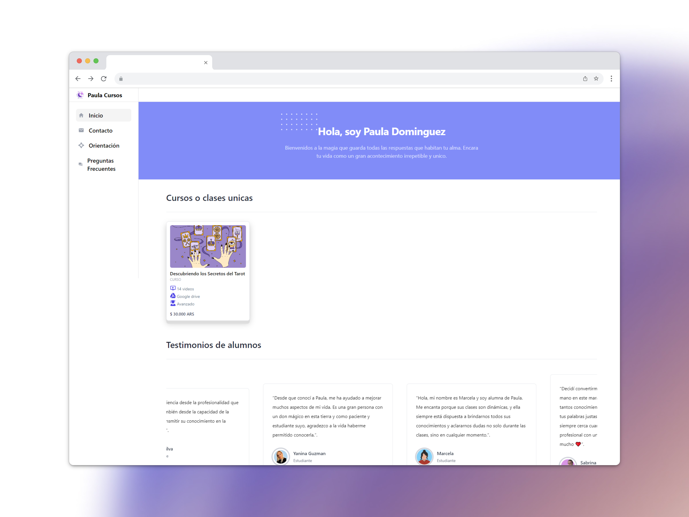

# PAULA APPSITE (SALE OF COURSES AND CLASSES)

This web application is designed for Paula, a tarot reader who offers specialized courses and unique classes. Through this platform, Paula can market her services and courses online using Mercado Pago's payment gateway.

## Preview image 👁

## Deployment 📦

- [DEMO](https://courses-selling-app.vercel.app/) - Website

## Built With 🛠️

- Backend: Node.js, Express.js, MongoDB
- Frontend: Next.js, Tailwind, Typescript

## API

I integrated the Resend API into the form to receive messages and capture user information. This allows me to establish effective contact with users who submit queries through the form.

I have implemented the Mercado Pago API in a specialized way, incorporating it in a checkout button. When the user clicks on this button, he is redirected to Mercado Pago's secure payment process, guaranteeing a safe transaction for both the user and the seller.

- Resend API: [Documentation](https://resend.com/docs/introduction)
- MercadoPago API: [Documentation](https://www.mercadopago.com.ar/developers/es/docs/checkout-api/landing)

## Authors ✒️

- **Lucas Quiroga** - _Initial work_ - [Lucas Quiroga](https://github.com/Lucas-Quiroga)

## License 📄

This project is licensed © LUCAS QUIROGA 2023, all rights reserved.
